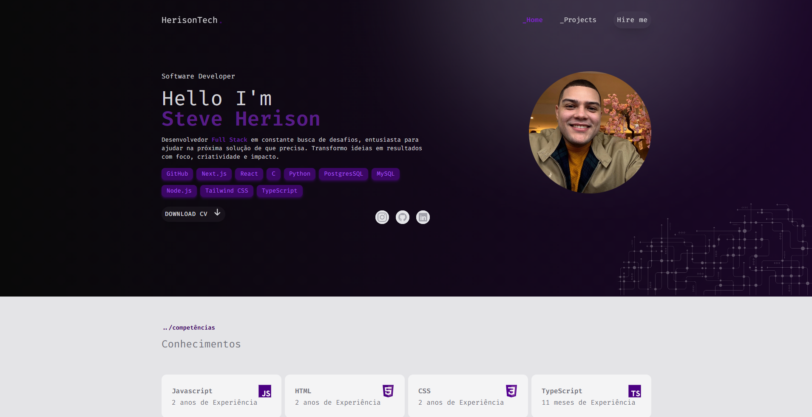
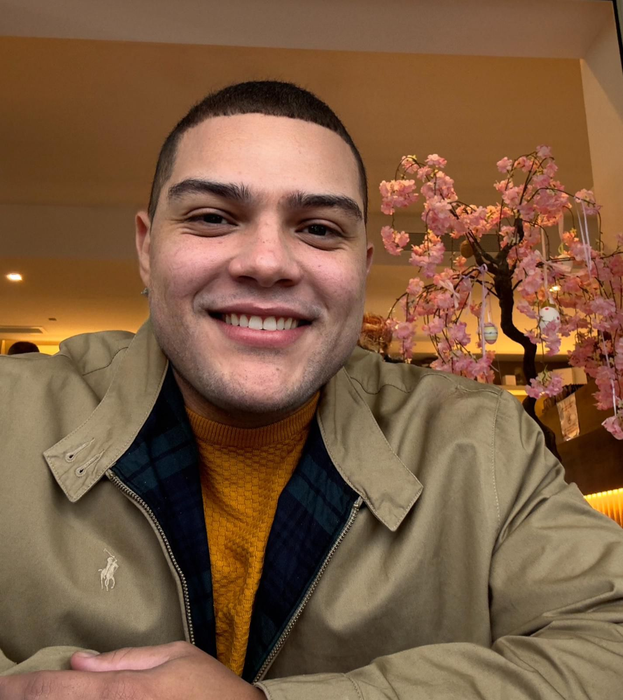

[TYPESCRIPT]: https://img.shields.io/badge/typescript-%23007ACC.svg?style=for-the-badge&logo=typescript&logoColor=white
[NEXT]: https://img.shields.io/badge/Next-black?style=for-the-badge&logo=next.js&logoColor=white
[NODE]: https://img.shields.io/badge/node.js-6DA55F?style=for-the-badge&logo=node.js&logoColor=white
[TAILWINDCSS]: https://img.shields.io/badge/tailwindcss-%2338B2AC.svg?style=for-the-badge&logo=tailwind-css&logoColor=white
[PROJECT__BADGE]: https://img.shields.io/badge/📱Visit_this_project-000?style=for-the-badge&logo=project
[PROJECT__URL]: https://herisontech.vercel.app/

<h1 align="center" style="font-weight: bold;">Portfólio HerisonTech 💻</h1>

![NodeJS][NODE]
![Next JS][NEXT]
![TypeScript][TYPESCRIPT]
![TailwindCSS][TAILWINDCSS]

 <a href="#about">About</a> • 
  

    

<h2 id="started">📌 About</h2>

Desenvolvi um portfólio para minha empresa com o objetivo de apresentar meus conhecimentos e projetos. Busco trazer soluções criativas e enfrentar desafios que contribuam para melhorar o dia a dia das pessoas, unindo tecnologia e inovação.

[![project][PROJECT__BADGE]][PROJECT__URL]

<h2 id="colab">🤝 Collaborator</h2>

<table>
  <tr>
    <td align="center">
      <a href="#">
         
        
          <b>Steve Herison</b>'
        
      </a>
    </td>
    
</table>
